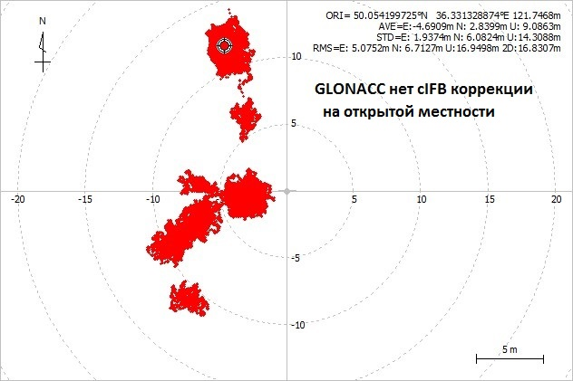
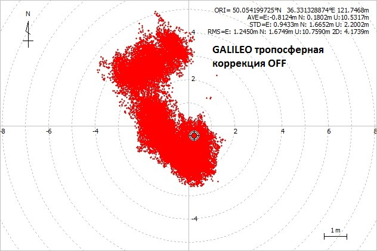
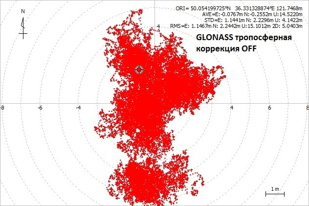
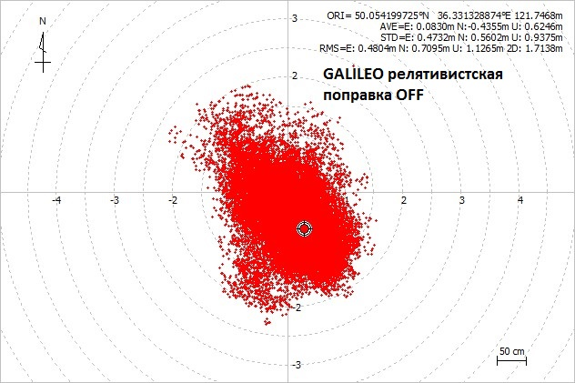

# Accuracy-GNSS
Експериментальное исследование точности GNSS в зависимости от коррекции и внешних условий

Использовалась [quadrifilar backfire helix](http://lea.hamradio.si/~s53mv/navsats/n16.gif)  антенна, NEO-M8T и [RTKLIB](http://www.rtklib.com) в режиме Solution: SINGLE, т.е. обычный GNSS приемник. Наличие source RTKLIB  позволяет производить любые эксперименты с "сырыми" данными GNSS. 
NEO-M8T в одно и то же время и антенны выдает независимые данные от 3-х GNSS систем:
### GPS  GLONASS GALILEO
Запись "сырых данных" (RAWX) на открытой местности неподвижно в течении 1ч 50 мин с частотой 5Hz  находится в файле quadrifilar_backfire_helix_antenna.zip (4 части).
В условиях когда возможны переотражения, например, городские улицы, ошибка может быть и 300 метров и более.

