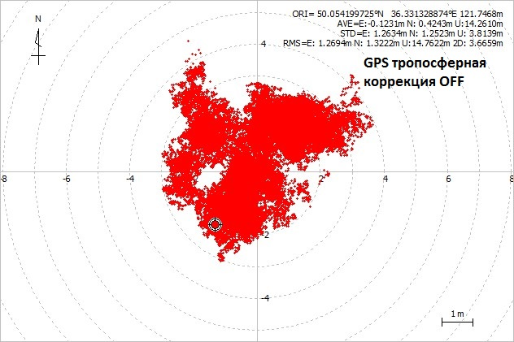

# Accuracy-GNSS
Експериментальное исследование точности GNSS в зависимости от коррекции и внешних условий

Использовалась [quadrifilar backfire helix](http://lea.hamradio.si/~s53mv/navsats/n16.gif)  антенна, NEO-M8T и [RTKLIB](http://www.rtklib.com) в режиме Solution: SINGLE, т.е. обычный GNSS приемник. Наличие source RTKLIB  позволяет производить любые эксперименты с "сырыми" данными GNSS. С общей антенны NEO-M8T в одно и то же время выдает независимые данные от 3-х GNSS систем:
### GPS  GLONASS GALILEO
Подключив выход передатчика [Real-time GPS signal simulator](https://github.com/IvanKor/hrfGPS) через аттенюатор на антенный вход NEO-M8T
на 1.5 часа и включив все коррекции убеждаемся что за это время суммарная погрешность (RMS) ~ 0.1 метра.

Запись "сырых данных" (RAWX) на открытой местности неподвижно в течении 1ч 50 мин с частотой 5Hz  находится в файле quadrifilar_backfire_helix_antenna.zip (4 части).

В условиях когда возможны переотражения, например, городские улицы, ошибка может быть и 300 метров и более.
### Переотражения главный источник погрешности в GNSS.

На открытой местности, при всех включенных коррекциях :
Ionosphere  Correction : Broadcast (идет со спутников)
Troposphere Correction : Saastamoinen (одна из моделей тропосферы)
получим для GPS за 1ч 50 мин наблюдения  RMS ~ 0.4 метра, что всего в 4 раза больше против GPS signal simulator случая.

Сигналы со спутников GALILEO идут на той же частоте что и GPS с уровнем на ~ 5dB меньше, меньше и количество спутников GALILEO,
отсюда RMS у GALILEO больше.

NEO-M8T может принимать и BEIDOU. Поскольку большинство спутников китайской GNSS находится над Китаем то с Европы они
находятся на Востоке горизонта. Из расмотрения исключены поскольку в этом случае тяжело отличить искажения атмосферы или расположение спутников, приводятся чисто информативно.

Как видим GLONASS имеет более чем в 10 раз большую погрешность чем GPS. Эта ошибка вызвана частотным разделением каналов.
На каждой частоте свои условия распространения и как следствии свои задержки которые не поддаются моделированию.
Относительно GPS эти задержки можно вычислить как невязки но при этом добавится погрешность GPS.

В процедуре decode_rxmrawx RTKLIB для GLONASS спутников добавим  коррекцию псевдорадиуса на основе невязок с GPS.
Получим картинку которая удобна для дальнейших исследований.

Коррекцию псевдорадиуса делаем по кривой exp1.
Как следует из этих графиков табличный метод коррекции частотной задержки невозможен.
Именно по этой причине GLONASS переходит от частотного разделения к чисто кодовому на одной частоте.
Уже 2 спутника работают в чисто кодовом разделении.

### Выключим ионосферную коррекцию что передается со спутников.
Как видим, для всех 3-х GNSS влияние ионосферы довольно не существенно,
хотя существует очень большое количество источников где авторы утверждают обратное, мол главный источник ошибок это ионосфера.

### Выключим тропосферную коррекцию .
Как видим, для всех 3-х GNSS влияние тропосферы весьма  существенно, второе после переотражений, хотя существует очень большое количество источников где авторы утверждают обратное, мол главный источник ошибок это ионосфера а тропосфера не существенна поскольку её толщина всего ~ 10 км.

### Выключим поправку на Луну и Солнце в GLONASS .
Эфиремиды в GLONASS весьма просты по отношению GPS. Передается вектор положения спутника, вектор скорости и 
вектор ускорения вызванный Луной и Солнцем. Как видим влияние Луны и Солнца на спутники весьма мало, оно ничтожно по сравнению
с cIFB ошибкой которая не передается вообще. 

###  Выключим релятивистскую поправку связанную с эксцентриситетом орбиты. 

Для GPS эта поправка существеннее тропосферной, большая.

Для GALILEO релятивистская поправка почти равна НУЛЮ и её учет фактически ничего не дает в плане точности.
Хотя она считается по одной и той же формуле что и для GPS, в одной и той же ветви RTKLIB.
Спутники GALILEO и GPS имеют примерно одинаковый эксцентриситет орбиты.
Такое очень большое расхождение можно объяснить только тем что в эфиремиды GALILEO не закладывается
рел. формула которая потом вычитается.

В GLONASS релятивистская поправка учитывается безразмерной гаммой_н которая обновляется раз в 30 мин, заложена в эфиремиду.
Как видим отключение этой поправки практически не сказывается на точности, она ничтожно мала по сравнению с cIFB ошибкой.

Для GALILEO и GLONASS релятивистская поправка связанная с эксцентриситетом орбиты фактически ничтожная,
однако это не мешает публиковать статьи где утверждается что спутники GALILEO с высокой точностью подтверждают 
формулу релятивистской поправки что используется в GPS.
